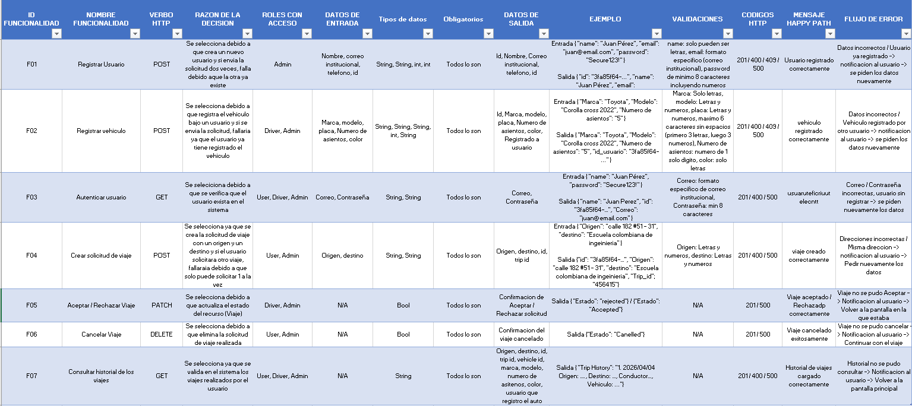

# DOSW_ParcialT2_StivenPardo

**Nombre Completo:** Stiven Pardo  
**Grupo:** 2

## 1 funcionalidades 

## 2 Diferencia entre Validaciones de input y Validaciones de negocio

## 3 Diferencias entre autenticación, autorización e integridad

## 4 Diagrama de Componentes general

## 5 ¿Qué problemas pueden surgir si no se separan correctamente las capas dentro de un proyecto de software?

## 6 Diagrama de componentes

## 7 ¿Cuáles son las diferencias entre un validador, una utilidad y un servicio?

## 8 Diagrama de clases

## 9 Diagrama de entidad relacion

## 10 2 indices para mejorar el rendimiento de las consultas

## 11

## 12 Como las pruebas garantizan el cumplimiento de las reglas de negocio y la integridad del sistema

## 13 Describir las etapas principales de un pipelien y en que consiste

## 14
# ¿Qué sucede si una prueba falla en el pipeline?

# ¿Debe permitirse el despliegue?

## 15 Explique el concepto de logging en el manejo de errores

# a ¿Qué información debería registrarse?

# b ¿Qué NO debería registrarse (por seguridad)?

## 16 Figma

## Evidencias de Cuentas

### Herramienta de Modelado (Lucidchart / Draw.io / Miro)

### Herramienta de Diseño de Interfaces (Figma)

https://github.com/6Sebastian6/PreParcial-T2/tree/develop
